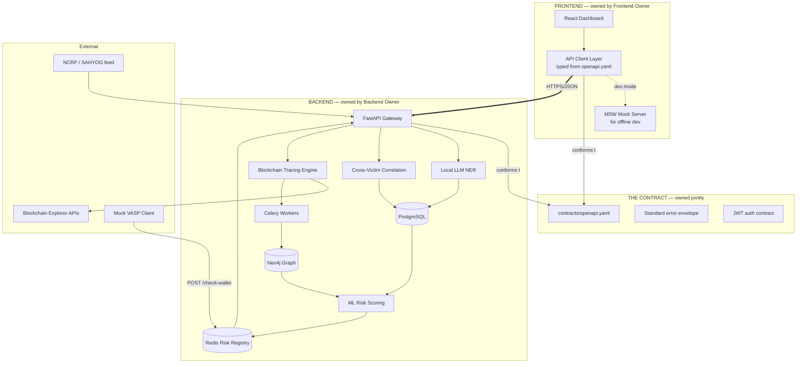
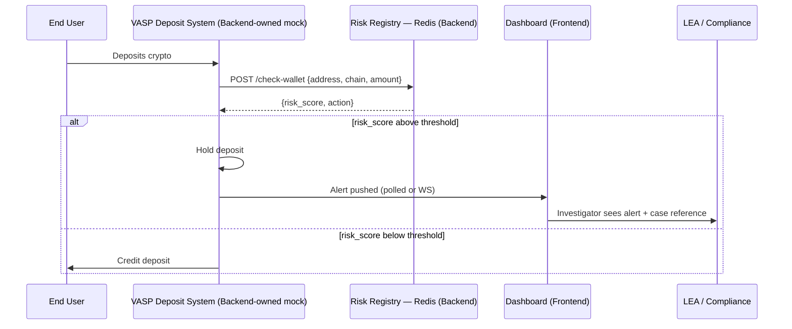
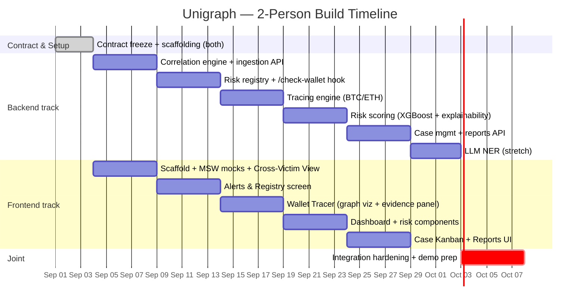

# Product Requirements Document — Unigraph
### Real-Time Crypto Fraud Attribution System
**SIH Problem Statement ID:** 26183 · **Organization:** Ministry of Home Affairs — I4C, CIS Division · **Theme:** Blockchain & Cybersecurity

| | |
|---|---|
| **Doc version** | 0.2 (deepened — split for a 2-person build: one Backend Owner, one Frontend Owner) |
| **Owner** | *[team lead name]* |
| **Last updated** | 28 Aug 2026 |
| **Status** | Draft — pending team sign-off on Open Questions (§20) |

---

## 0. How to use this document

This revision goes deeper than v0.1 in two directions: (1) every layer of the system now has an explicit **owner** — Backend or Frontend — so two people can build in parallel without stepping on each other, and (2) the **integration seam** (§8, the API contract) is treated as a first-class deliverable that gets built *before* either side writes feature code, not discovered afterward.

- If you're the **Backend Owner**, your map is §6, §7, §9, §11, §12, §13.
- If you're the **Frontend Owner**, your map is §6, §7, §10, §11, §14.
- Both of you must agree on §8 (the contract) before Phase 1 starts — it's the one section neither of you owns alone.
- §17–18 is the actual week-by-week task list, split by name, with sync points marked.
- Sections 1–5, 15–16, 19–20 carry over from v0.1 largely unchanged; they're condensed here — see v0.1 for the original wording if needed.

---

## 1. Problem Statement (as issued)

Cyber fraud victims report suspect wallet addresses across investment scams, task-based frauds, sextortion, ransomware, phishing, darknet transactions, and organized cyber-enabled financial crime. Reported wallets are frequently non-custodial, temporary "burner" wallets, or intermediary layering wallets. Investigators currently cannot quickly determine **which exchange/VASP** a wallet ultimately funnels into, which delays freezing assets, preserving evidence, and recovering victim funds.

**Ask:** ingest victim-reported wallet addresses, trace blockchain activity, identify the nearest exchange/VASP, detect laundering patterns, and produce actionable intelligence for law enforcement — with dashboards, alerting, SAHYOG/NCRP integration, and multi-chain support.

---

## 2. Team & Ownership Model

This is the change that shapes everything else in this revision.

| Role | Owns | Does not touch (unless pairing) |
|---|---|---|
| **Backend Owner** | FastAPI service, Postgres, Neo4j, Redis, Celery workers, ML pipeline, blockchain-explorer integrations, local LLM/NER, auth issuance, `/check-wallet` hook, PDF report generation | React app internals, Tailwind theming, client-side state |
| **Frontend Owner** | React + TypeScript app, all six screens (§14), design system, client-side state, API client layer, graph visualization, auth *consumption* (token storage, route guards) | Database schemas, ML models, Celery, Neo4j Cypher, explorer API keys |

**The one shared artifact both people write to together is `contracts/openapi.yaml`** (§8). Everything else — folder structure, tech choices inside each half, internal module boundaries — belongs to whoever owns that half. This is deliberate: a 2-person team loses more time to merge conflicts and "wait, is this your job or mine" than to any individual technical problem, so the ownership line has to be unambiguous from day one.

**Working agreement to adopt explicitly:**
1. No endpoint's request/response shape changes without both people editing `openapi.yaml` together (even a 2-minute call) — never a silent backend change that breaks a frontend assumption.
2. Frontend never blocks on backend. Every screen is built against a mock (§8.4) first, then pointed at the real endpoint via one environment variable flip.
3. Backend never blocks on frontend. Every endpoint is testable via FastAPI's auto-generated `/docs` (Swagger UI) or `curl`/Postman before any UI consumes it.
4. Daily 10–15 min sync (async is fine — a shared doc/Slack thread works) covering: what shipped, what's blocked, any contract changes needed.

---

## 3. Objectives & Success Metrics

Same north star as v0.1, unchanged:

1. **Speed to freeze** — minutes, not days, from complaint to actionable wallet risk signal.
2. **Defensibility** — every alert traces to a concrete, explainable evidence chain, not a black-box score.
3. **Sovereignty** — no unredacted FIR data leaves Indian government infrastructure.
4. **Low false-positive rate** — the `/check-wallet` hook sits in a live money-movement path; false positives have real consequences.

| Metric | Target |
|---|---|
| Wallet reported → nearest-VASP identified (direct deposit case) | < 5 min |
| Wallet reported → 3-hop trace complete | < 30 min |
| Cross-Victim Correlation precision | > 98% |
| Risk model AUC-PR (held-out) | > 0.85 |
| False positive rate at deployed threshold | < 1% |
| Chains at demo | BTC, ETH, TRON (USDT-TRC20) — see §20 for why BSC is deferred with a 2-person team |

---

## 4. Our Three Differentiators (USPs) — with build ownership

### USP 1 — Cross-Victim Correlation Engine *(build first — Backend-heavy, Frontend-light)*
Mine the complaint database itself: the same wallet reported by multiple victims is a strong, self-contained freeze signal that needs zero blockchain data. **Backend:** exact-match/dedup SQL logic, scoring function. **Frontend:** one table view (§14, Cross-Victim View) — this is the cheapest end-to-end slice to demo, which is exactly why it's Phase 1 for both of you.

### USP 2 — Real-Time Chokepoint at Deposit ("stop the money before cash-out")
VASPs query Unigraph on every incoming deposit before crediting the user. **Backend:** Redis risk registry, `/check-wallet` hook, mock VASP client, alert fan-out. **Frontend:** Alerts & Registry screen showing live hold/block decisions tied to case references. Most demo-able of the three without real blockchain infra — good second slice for a 2-person team.

### USP 3 — 100% Data Sovereignty via Local LLM & On-Prem Graph
FIR narratives never leave the intranet — entity extraction runs on a locally hosted LLM (Ollama + Llama-3/Mistral), graph lives in local Neo4j. **Backend only** — no frontend dependency beyond displaying already-extracted fields read-only. Treat as a stretch goal for a 2-person team (§20).

---

## 5. Primary Users

| Persona | Needs |
|---|---|
| **Cyber Cell Investigator** | Paste a wallet, get nearest VASP + confidence in minutes; file a standardized freeze request |
| **I4C / NCRP Triage Analyst** | See which incoming complaints share wallets with existing cases |
| **VASP Compliance Officer** | Receive real-time hold/block signal + case reference on suspicious deposits |
| **State Nodal Officer / Supervisor** | Dashboard of case status, funds frozen, response-time trend |

---

## 6. System Architecture — with ownership boundary drawn explicitly



**Reading this diagram:** the only arrow that crosses the ownership boundary is `APICLIENT ⇄ API`, and it's constrained entirely by `SPEC`. If both people build correctly against that one file, everything on either side is free to be refactored internally without breaking the other person's work.

### Sequence — real-time chokepoint (USP 2), now annotated by owner



---

## 7. Repository & Folder Structure (modular by design)

**Recommendation: one monorepo**, two independently runnable apps, one shared contracts folder. A monorepo beats two separate repos for a 2-person team specifically because the contract file needs to be visible and diffable to both people in the same PR review flow.

```
unigraph/
├── backend/
│   ├── app/
│   │   ├── main.py                 # FastAPI app entrypoint
│   │   ├── core/                   # config.py, security.py, logging.py
│   │   ├── api/v1/
│   │   │   ├── routers/            # complaints.py, wallets.py, correlate.py,
│   │   │   │                       # check_wallet.py, cases.py, alerts.py, auth.py
│   │   │   └── deps.py             # shared FastAPI dependencies (auth guard, db session)
│   │   ├── schemas/                # Pydantic request/response models — MIRRORS openapi.yaml
│   │   ├── models/                 # SQLAlchemy ORM models
│   │   ├── services/               # correlation_service.py, tracing_service.py,
│   │   │                           # risk_service.py, registry_service.py, report_service.py
│   │   ├── ml/                     # features.py, risk_model.py, clustering.py, rules.py
│   │   ├── graph/                  # neo4j_client.py, cypher.py
│   │   ├── nlp/                    # llm_ner.py, spacy_fallback.py
│   │   ├── workers/                # celery_app.py, tasks/
│   │   ├── db/                     # session.py, alembic/ (migrations)
│   │   └── tests/                  # pytest, one folder per module above
│   ├── requirements.txt
│   ├── Dockerfile
│   └── .env.example
├── frontend/
│   ├── src/
│   │   ├── app/                    # React Router setup, layout shell
│   │   ├── pages/                  # Dashboard/, WalletTracer/, CrossVictimView/,
│   │   │                           # CaseManagement/, Alerts/, GraphExplorer/, Reports/, Settings/
│   │   ├── features/               # feature-sliced modules, each self-contained:
│   │   │                           #   wallet-tracer/{components,hooks,api}
│   │   │                           #   correlation/{components,hooks,api}
│   │   │                           #   cases/{components,hooks,api}
│   │   │                           #   alerts/{components,hooks,api}
│   │   ├── components/             # shared/dumb UI atoms — Button, RiskBadge, Card, Modal
│   │   ├── api/
│   │   │   ├── types.gen.ts        # generated from openapi.yaml (openapi-typescript)
│   │   │   ├── client.ts           # thin fetch/axios wrapper, base URL from env
│   │   │   └── hooks/              # React Query hooks per resource
│   │   ├── store/                  # zustand slices — ui.ts, auth.ts
│   │   ├── mocks/                  # MSW handlers — MUST mirror openapi.yaml examples
│   │   ├── styles/                 # tailwind.config.ts, tokens.ts (palette from §14.1)
│   │   └── tests/
│   ├── package.json
│   ├── Dockerfile
│   └── .env.example
├── contracts/
│   ├── openapi.yaml                # SOURCE OF TRUTH — edited by both, reviewed by both
│   ├── entities.md                 # shared vocabulary — see §8.2
│   └── CHANGELOG.md                # one line per contract change, dated, who requested it
├── infra/
│   ├── docker-compose.yml          # postgres + neo4j + redis + backend + frontend
│   └── docker-compose.dev.yml      # backend-only, for frontend dev against real API
├── docs/
│   ├── PRD.md                      # this document
│   └── demo-script.md
└── README.md                       # "how to run this in 5 minutes" — write this first, not last
```

**Modularity rule for both sides:** no module reaches into another module's internals directly — `services/` talks to `models/` and `graph/`, never the other way; `features/wallet-tracer/` never imports from `features/cases/`. Cross-feature sharing goes through `components/` (frontend) or `schemas/`+`services/` (backend). This is what makes it possible for one person to rewrite the tracing engine's internals in week 3 without the correlation engine (built in week 1) breaking.

---

## 8. The Integration Contract

This section is the actual answer to "how do two people building separately end up with one working system." Build this *before* Phase 1 feature work starts — budget half a day, together, not split.

### 8.1 `contracts/openapi.yaml` is the single source of truth
Every endpoint in §11 gets a full OpenAPI 3.0 entry: path, method, request schema, response schema (success *and* error), example payloads. FastAPI can auto-generate this from Pydantic schemas (`/openapi.json`), which is convenient — but for a 2-person team, write the YAML by hand first as a design step, then let the Pydantic schemas conform to it, rather than letting the backend's internal shape leak out as "the contract" by accident.

### 8.2 Shared entity vocabulary (`contracts/entities.md`)
Both people agree on field names and types for the core nouns before either writes code against them:

| Entity | Key fields | Notes |
|---|---|---|
| `Wallet` | `address, chain, risk_score, risk_tier, vasp_identified, cluster_id, last_seen` | `risk_tier` is a closed enum: `critical\|high\|medium\|low\|unknown` — matches the palette in §14.1 exactly, so frontend never re-derives tier from score |
| `Complaint` | `id, ncrp_ref, narrative_text, fraud_typology, amount_lost, filed_at, state, district` | |
| `Case` | `id, status, assigned_investigator, opened_at, closed_at` | `status` enum: `new\|investigating\|escalated_to_vasp\|frozen\|closed` — matches Kanban columns in §14.3 exactly |
| `Alert` | `id, wallet_id, case_id, triggered_by, action, created_at, resolved_at` | `action` enum: `allow\|hold\|block` |
| `RiskEvidence` | `feature_name, contribution, direction` | powers the "why flagged" panel — see §13.4 |

Enums are defined **once**, here, and referenced by name in both the Pydantic schemas and the generated TypeScript types — never redefined independently on each side.

### 8.3 Cross-cutting conventions (apply to every endpoint)

| Convention | Rule |
|---|---|
| Versioning | All routes under `/api/v1/...`; a breaking change gets a new version prefix, never a silent shape change |
| Auth | `Authorization: Bearer <JWT>` on every route except `/api/v1/auth/login`; role claim in token drives RBAC |
| Error envelope | `{ "error": { "code": "string", "message": "string", "details": {} } }` with matching HTTP status — never a bare 500 with an HTML stack trace |
| Pagination | `?page=1&page_size=25` → `{ "items": [...], "total": N, "page": 1, "page_size": 25 }` |
| Timestamps | ISO-8601 UTC, always, both directions |
| IDs | UUIDv4 strings for all primary keys exposed over the API (never leak Postgres serial ints) |

### 8.4 How the frontend avoids ever being blocked
1. `frontend/src/mocks/` holds an MSW (Mock Service Worker) handler per endpoint, hand-written from the *same* example payloads in `openapi.yaml`.
2. `VITE_USE_MOCKS=true` in `.env` routes all API calls through MSW instead of the network — the entire UI is buildable and demoable before a single backend route exists.
3. When a real endpoint ships, flip the flag off for that route (or globally) and verify against `infra/docker-compose.dev.yml` (backend + DBs only, no frontend container needed).
4. `frontend/src/api/types.gen.ts` is regenerated from `openapi.yaml` on every contract change (`npx openapi-typescript contracts/openapi.yaml -o src/api/types.gen.ts`) — the frontend gets a compile error the moment its assumptions drift from the contract, instead of a runtime surprise.

### 8.5 How the backend avoids ever being blocked
FastAPI serves interactive docs at `/docs` (Swagger UI) and `/redoc` automatically from the Pydantic schemas — every endpoint is testable by hand or via `curl`/Postman/`httpie` the moment it's written, with zero dependency on the frontend existing yet.

---

## 9. Backend Architecture (deep dive)

### 9.1 Layering
`routers/` (HTTP concerns only — parsing, status codes) → `services/` (business logic, framework-agnostic) → `models/` + `graph/` + `nlp/` + `ml/` (data/ML access). Routers never touch SQLAlchemy or Neo4j directly — only through a service. This is what lets `services/` be unit-tested without spinning up FastAPI, and lets the Backend Owner swap, say, the correlation matching algorithm without touching a single router.

### 9.2 Request lifecycle for `/check-wallet` (the latency-critical path)
```
VASP → API Gateway (auth/rate-limit) → registry_service.lookup()
     → Redis GET risk:{chain}:{address}   [only this — no Postgres/Neo4j in the hot path]
     → action = allow|hold|block by threshold
     → if hold: enqueue Celery task (alert_service.notify) — async, off the response path
     → return {risk_score, action}         [p95 target: <200ms — see §16]
```
Keeping Postgres/Neo4j entirely out of this path is the key design decision behind the <200ms target — the registry is a *materialized* view, refreshed asynchronously by the risk-scoring pipeline, never computed on demand.

### 9.3 Async workers (Celery)
Heavy jobs run off the request path: multi-hop graph traversal, GNN/clustering inference, PDF report generation, registry refresh after a new LEA-confirmed label. Redis doubles as broker for the prototype (swap to RabbitMQ only if queue depth becomes a real problem — don't add infra the demo doesn't need).

### 9.4 Data model (expanded)

**PostgreSQL — DDL-level detail, not just table names:**
```sql
CREATE TABLE complaints (
    id UUID PRIMARY KEY DEFAULT gen_random_uuid(),
    ncrp_ref TEXT UNIQUE,
    source_platform TEXT NOT NULL,          -- 'ncrp' | 'sahyog' | 'manual'
    complainant_id UUID,
    narrative_text TEXT,
    fraud_typology TEXT,                    -- enum-like, validated in app layer
    amount_lost NUMERIC(14,2),
    filed_at TIMESTAMPTZ NOT NULL,
    state TEXT, district TEXT,
    created_at TIMESTAMPTZ DEFAULT now()
);

CREATE TABLE wallets (
    id UUID PRIMARY KEY DEFAULT gen_random_uuid(),
    address TEXT NOT NULL,
    chain TEXT NOT NULL,                    -- 'BTC' | 'ETH' | 'TRON' | 'BSC'
    first_seen TIMESTAMPTZ, last_seen TIMESTAMPTZ,
    risk_score NUMERIC(4,3),                -- 0.000–1.000
    risk_tier TEXT,                         -- matches §8.2 enum exactly
    vasp_identified TEXT,
    cluster_id UUID,
    UNIQUE (address, chain)
);
CREATE INDEX idx_wallets_risk_tier ON wallets (risk_tier);

CREATE TABLE complaint_wallets (             -- powers USP 1
    complaint_id UUID REFERENCES complaints(id),
    wallet_id UUID REFERENCES wallets(id),
    reported_at TIMESTAMPTZ DEFAULT now(),
    PRIMARY KEY (complaint_id, wallet_id)
);

CREATE TABLE cases (
    id UUID PRIMARY KEY DEFAULT gen_random_uuid(),
    status TEXT NOT NULL DEFAULT 'new',     -- matches §8.2 enum exactly
    assigned_investigator TEXT,
    opened_at TIMESTAMPTZ DEFAULT now(),
    closed_at TIMESTAMPTZ
);

CREATE TABLE case_wallets (
    case_id UUID REFERENCES cases(id),
    wallet_id UUID REFERENCES wallets(id),
    PRIMARY KEY (case_id, wallet_id)
);

CREATE TABLE alerts (
    id UUID PRIMARY KEY DEFAULT gen_random_uuid(),
    wallet_id UUID REFERENCES wallets(id),
    case_id UUID REFERENCES cases(id),
    triggered_by TEXT,                      -- 'check_wallet_hook' | 'registry_refresh' | 'manual'
    action TEXT,                            -- allow | hold | block
    created_at TIMESTAMPTZ DEFAULT now(),
    resolved_at TIMESTAMPTZ
);

CREATE TABLE audit_log (
    id BIGSERIAL PRIMARY KEY,
    actor TEXT, action TEXT, entity TEXT, entity_id UUID,
    timestamp TIMESTAMPTZ DEFAULT now()
);
```

**Neo4j (graph):**
```
(:Wallet {address, chain})
(:Transaction {tx_hash, amount, timestamp, chain})
(:VASP {name, jurisdiction})
(:Cluster {id, confidence})

(:Wallet)-[:SENT]->(:Transaction)-[:RECEIVED_BY]->(:Wallet)
(:Wallet)-[:BELONGS_TO]->(:Cluster)
(:Wallet)-[:DEPOSITS_TO]->(:VASP)
```
Nearest-VASP query:
```cypher
MATCH path = (w:Wallet {address:$addr})-[:SENT*1..5]->(:Transaction)-[:RECEIVED_BY]->(v:Wallet)-[:DEPOSITS_TO]->(vasp:VASP)
RETURN path ORDER BY length(path) ASC LIMIT 1
```

**Redis (risk registry) — key shape:**
```
risk:{chain}:{address} → {"score": 0.92, "tier": "critical", "case_ref": "NCRP-2026-XXXX", "flagged_at": "...", "ttl": 2592000}
```

### 9.5 Security specifics the Backend Owner implements
JWT issuance + refresh (`/api/v1/auth/login`, `/api/v1/auth/refresh`), RBAC middleware reading a `role` claim (`admin | investigator | compliance_viewer`), TLS termination config, audit-log write on every case view/export, and — critically for USP 3 — the FIR narrative text never appears in any outbound HTTP call except to the local Ollama instance.

---

## 10. Frontend Architecture (deep dive)

### 10.1 Stack decisions
React + TypeScript + Tailwind CSS, Vite as the bundler (fast HMR matters for a compressed timeline), React Router for navigation, **TanStack Query (React Query)** for all server state (caching, refetch-on-focus, optimistic updates for case-status drag-and-drop), **Zustand** for the small amount of pure client state (sidebar collapsed, selected graph node, active filters) — deliberately not Redux, since a 2-person team doesn't need that ceremony.

### 10.2 Feature-sliced structure (why `features/` exists)
Each screen in §14 maps to one folder under `features/` containing its own `components/`, `hooks/`, and `api/` (React Query hooks scoped to that feature). This means the Cross-Victim View (built Week 1) and the Wallet Tracer (built Week 3) never accidentally share mutable state or import each other's internals — each is independently deletable/rewritable, which matters when scope gets cut under time pressure (§20).

### 10.3 API client layer
```
api/client.ts        — one fetch wrapper: base URL from VITE_API_BASE_URL,
                        attaches JWT, unwraps the §8.3 error envelope into thrown errors
api/types.gen.ts      — generated, never hand-edited, regenerated on every contract change
api/hooks/useWallet.ts, useCases.ts, useAlerts.ts, useCorrelation.ts
                      — thin React Query wrappers: useQuery/useMutation + typed responses
```
No component ever calls `fetch` directly — always through a typed hook. This is what makes the MSW-mock-to-real-API swap (§8.4) a one-line env change instead of a find-and-replace across the codebase.

### 10.4 Graph visualization (Wallet Tracer centerpiece)
`react-force-graph` (or `vis-network` as fallback) rendering nodes = wallets (colored by `risk_tier`, using the exact palette in §14.1 — never a re-derived color), edges = transactions. Right-hand drawer is a separate component subscribing to "selected node" state (Zustand), pulling risk/evidence/case data via `useWallet(address)`.

### 10.5 Real-time strategy — kept deliberately simple for 2 people
Polling every 5–10s on the Alerts screen (`useQuery` with `refetchInterval`) for v1. A WebSocket/SSE push channel is a listed stretch goal (§20) — building and testing a WS contract adds real integration surface that a 2-person team should only take on after the polling version is solid and demo-ready.

### 10.6 Design tokens (from the original palette, now formalized as code)
`styles/tokens.ts` exports the exact hex values from §14.1 as named constants (`riskCritical`, `riskHigh`, …) consumed by Tailwind config *and* by any inline SVG/graph-node coloring — one definition, not duplicated between CSS and JS.

### 10.7 Testing
Component tests with Vitest + React Testing Library; MSW handlers double as both dev mocks and test fixtures, so a test asserting "critical wallet renders red badge" uses the same fixture data the Frontend Owner was building the UI against all along.

---

## 11. Full API Specification

Standard envelope and versioning per §8.3 apply to all routes below.

| Endpoint | Method | Auth | Request | Success response |
|---|---|---|---|---|
| `/api/v1/auth/login` | POST | none | `{email, password}` | `{access_token, refresh_token, role}` |
| `/api/v1/auth/refresh` | POST | refresh token | `{refresh_token}` | `{access_token}` |
| `/api/v1/complaints` | POST | investigator+ | `{ncrp_ref?, source_platform, narrative_text, fraud_typology, amount_lost, filed_at, state, district}` | `201 {id, ...echoed fields}` |
| `/api/v1/complaints` | GET | any | query: `?page&page_size&state&fraud_typology` | paginated `Complaint[]` |
| `/api/v1/wallets/{address}/trace` | GET | investigator+ | path: `address`; query: `?chain` | `{wallet, path: Hop[], nearest_vasp, hops_count, traced_at}` |
| `/api/v1/wallets/{address}/risk` | GET | investigator+ | query: `?chain` | `{risk_score, risk_tier, evidence: RiskEvidence[]}` — see §13.4 |
| `/api/v1/correlate` | POST | investigator+ | `{wallet_id}` or `{address, chain}` | `{correlation_score, linked_complaints: Complaint[], distinct_geographies, total_amount}` |
| `/check-wallet` | POST | **VASP API key**, not JWT | `{address, chain, amount}` | `{risk_score, action, case_ref?}` — p95 < 200ms |
| `/api/v1/cases` | GET | any | query: `?status&page` | paginated `Case[]` |
| `/api/v1/cases/{id}` | PATCH | investigator+ | `{status?, assigned_investigator?}` | `200 Case` |
| `/api/v1/cases/{id}/report` | GET | investigator+ | — | `application/pdf` binary |
| `/api/v1/alerts` | GET | any | query: `?resolved&page` | paginated `Alert[]` |

**Error envelope example** (used by every endpoint above on failure):
```json
{ "error": { "code": "WALLET_NOT_FOUND", "message": "No wallet found for that address/chain pair.", "details": { "address": "1A1zP1...", "chain": "BTC" } } }
```

**`/check-wallet` uses a separate API-key auth scheme deliberately** — VASPs are external systems, not logged-in investigators, so this route is excluded from the JWT/RBAC guard and instead validated against a per-VASP API key stored server-side. Flag this explicitly in `openapi.yaml` (`security: [apiKeyAuth]` vs `security: [bearerAuth]`) so the Frontend Owner never mistakenly wires it through the normal authenticated client.

---

## 12. ML / AI Components (deeper)

| Need | Model | Feature detail |
|---|---|---|
| **Wallet risk scoring** | XGBoost / LightGBM, gradient-boosted trees (chosen over deep nets for explainability) | in-degree, out-degree, tx velocity (tx/hour), total volume in/out, wallet age, graph-hop distance to nearest known-illicit cluster, correlation score (from USP 1), fan-in count (≥N senders in <T time), fan-out count, mixer-proximity flag, cross-chain bridge usage flag, average tx value, time-of-day anomaly score |
| **Address clustering** | UTXO co-spend heuristic (BTC, near-free, high precision) + Node2Vec/GraphSAGE embeddings → HDBSCAN (ETH/TRON, account-based chains) | |
| **Laundering/layering detection** | v1: rule engine (fan-out, fan-in, peel-chain detection) + Louvain community detection + PageRank for hub wallets. Stretch: Temporal GNN (EvolveGCN) on Elliptic++ | Start with the rule engine — it's fast, explainable, and demo-safe |
| **Mixer flagging** | Known mixer/tumbler blocklist + Isolation Forest anomaly score | Output must say "traced to mixer, confidence degraded," never claim false certainty past an obfuscation point |
| **FIR entity extraction (USP 3, stretch)** | Local LLM (Llama-3-8B-Instruct via Ollama), structured JSON prompt, spaCy NER as fallback/validator | Air-gapped — see §9.5 |
| **Fraud typology classification** | Fine-tuned DistilBERT or zero-shot via local LLM | |
| **Cross-victim correlation** | No ML — deterministic exact-match; optional fuzzy record-linkage later | Lowest-effort, most defensible win — build first |

### 12.1 Training strategy
Elliptic/Elliptic++ uses a **temporal split** (first ~34 of 49 time steps train, remainder held out) — never random shuffling, which leaks future graph structure. Custom/synthetic data: 70/15/15 stratified by typology, plus a rolling "most recent 2 weeks" test set to simulate drift. Class imbalance handled via class-weighted or focal loss, with SMOTE-Tomek applied only to the training fold. Metrics in priority order: AUC-PR (primary), precision/recall at deployed threshold, FPR at threshold (<1% target), AUC-ROC (secondary), calibration (reliability curve — the score is used as a probability to drive allow/hold/block, not just for ranking).

### 12.2 Explainability → the evidence chain (feeds §11's `/risk` endpoint)
Every risk score ships with SHAP top-contributing features, shape:
```json
"evidence": [
  {"feature_name": "fan_in_count_1h", "contribution": 0.31, "direction": "increases_risk"},
  {"feature_name": "cross_victim_correlation_score", "contribution": 0.24, "direction": "increases_risk"},
  {"feature_name": "wallet_age_days", "contribution": -0.08, "direction": "decreases_risk"}
]
```
This is what makes "Defensibility" (§3) a real, renderable thing in the UI rather than a slide-deck claim — the Frontend Owner renders this array directly as the "why flagged" panel in the Wallet Tracer drawer, with zero backend changes needed if the shape stays stable.

---

## 13. Datasets

| Dataset | Chain | Use |
|---|---|---|
| Elliptic Data Set / Elliptic++ | Bitcoin | Primary benchmark for risk classifier + GNN |
| GraphSense TagPacks | Multi-chain | Address attribution/exchange labels |
| OFAC SDN crypto address list | Multi-chain | Hard blocklist seed |
| CryptoScamDB / Chainabuse | Multi-chain | Scam address seed list, typology labels |
| Etherscan label cloud / Forta alerts | Ethereum | Exchange/VASP tags, real-time threat signals |

Synthetic mock-NCRP dataset generated for the demo (complainant, narrative, wallet, amount, typology, geography, timestamp) with controlled shared-wallet duplication so the Cross-Victim Correlation Engine has something visible to correlate against.

---

## 14. UI / UX Design

### 14.1 Color palette (also lives in code — see §10.6)

| Token | Hex | Use |
|---|---|---|
| Background base | `#0B1120` | App background |
| Surface / panel | `#131B2E` | Cards, sidebar |
| Surface elevated | `#1B2438` | Modals, hover states |
| Border / divider | `#263047` | Panel edges |
| Primary accent | `#2F6FED` | Primary buttons, links, active nav |
| Secondary accent | `#14B8A6` | Success states, "traced" confirmations |
| Risk — Critical | `#EF4444` | |
| Risk — High | `#F97316` | |
| Risk — Medium | `#F59E0B` | |
| Risk — Low | `#22C55E` | |
| Risk — Unknown | `#64748B` | |
| Text primary | `#E5E7EB` | |
| Text secondary | `#94A3B8` | |

Typography: **Inter**/**IBM Plex Sans** for UI text, **JetBrains Mono**/**Roboto Mono** for wallet addresses, tx hashes, case IDs — monospace matters here so a "0"/"O" misread never happens on a copy-pasted address.

### 14.2 Screens (each maps 1:1 to a `features/` folder, §10.2)
- **Dashboard** — KPI cards (Active Cases, Wallets Flagged Today, Avg Trace Time, Funds Frozen), recent alerts table, risk heatmap by chain.
- **Wallet Tracer** — three-pane: search/filter · force-directed graph canvas · context drawer (risk gauge + §12.2 evidence panel, linked cases, VASP found, tx timeline).
- **Cross-Victim View** — table sorted by report count, drill-down to linked complaints/geographies. Best USP-1 demo screen.
- **Case Management** — Kanban, columns matching the `status` enum in §8.2 exactly: New → Investigating → Escalated to VASP → Frozen → Closed.
- **Alerts & Registry** — live (polled) hold/block decisions with case references.
- **Reports** — one-click PDF export per case.

Accessibility: WCAG AA contrast even in dark mode; risk-tier colors always paired with an icon/label, never color alone.

---

## 15. Security, Privacy & Compliance

FIR/complaint text processed only through the local air-gapped LLM. Encryption at rest (Postgres, Neo4j) and in transit (TLS everywhere). RBAC with full audit log on case view/export. Aligned with DPDP Act 2023 and MHA/I4C data-sovereignty guidance. The `/check-wallet` hook returns only a score/action, never case narrative, minimizing exposure to external VASPs.

---

## 16. Non-Functional Requirements

| Requirement | Target |
|---|---|
| `/check-wallet` latency | < 200ms p95 (Redis-only hot path — see §9.2) |
| Trace completion (3-hop) | < 30s cached, < 5min cold multi-chain |
| Dashboard load | < 2s |
| Registry propagation (new confirmed wallet → registry) | < 5 min |
| Availability target (production) | 99.9% for `/check-wallet` specifically |

---

## 17. Work Distribution — Phase-Wise, Split by Role (2-person build)

Assumes a multi-week SIH pre-finals runway (see §20 if this is actually a 36-hour hackathon — jump to §18). Each phase lists **Backend Owner** tasks, **Frontend Owner** tasks, and a **Sync Point** — the moment the two halves must actually talk, not just work in parallel.



### Phase 0 — Contract & Scaffolding (2–3 days, joint)
- **Both:** write `contracts/openapi.yaml` for every route in §11, agree on `entities.md` (§8.2), agree on the error envelope, spin up `infra/docker-compose.yml` skeleton.
- **Backend:** scaffold FastAPI app, Postgres/Neo4j/Redis containers, health-check route, `/docs` reachable.
- **Frontend:** scaffold Vite + React + TS + Tailwind, routing shell for all six screens (empty), MSW wired to serve every §11 endpoint's example payload, design tokens (§10.6) in place.
- **Definition of done:** `docker-compose up` brings up a backend that responds `200` on `/health`; `npm run dev` shows all six nav items with mock data flowing.

### Phase 1 — Cross-Victim Correlation, USP 1 (Week 1)
- **Backend:** `complaints`/`complaint_wallets` tables + migration, synthetic-NCRP generator script, correlation scoring logic, `POST /api/v1/complaints`, `POST /api/v1/correlate`.
- **Frontend:** Cross-Victim View fully built against MSW.
- **Sync point (mid-week):** Backend ships real `/correlate`; Frontend flips `VITE_USE_MOCKS` off for that one route, verifies the real response matches the contract exactly.

### Phase 2 — Risk Registry + Chokepoint, USP 2 (Week 2)
- **Backend:** Redis registry, `POST /check-wallet` (API-key auth, not JWT — see §11), mock VASP client, `alerts` table, `GET /api/v1/alerts`.
- **Frontend:** Alerts & Registry screen with polling (§10.5), risk-tier badges using §14.1 palette exactly.
- **Sync point:** contract review of `/check-wallet` and `alerts` shapes *before* backend starts — this is the highest-business-value demo path, worth a longer conversation than the others.

### Phase 3 — Blockchain Tracing (Week 3)
- **Backend:** BTC + ETH explorer integrations, Neo4j graph builder (Celery-async), nearest-VASP Cypher query, `GET /api/v1/wallets/{address}/trace`.
- **Frontend:** Wallet Tracer screen — force-directed graph, context drawer skeleton (evidence panel wired in Phase 4).

### Phase 4 — ML Risk Scoring (Week 3–4, overlaps Phase 3 frontend work)
- **Backend:** feature engineering (§12), XGBoost baseline trained on Elliptic, SHAP evidence output, `GET /api/v1/wallets/{address}/risk`.
- **Frontend:** Dashboard KPI cards + risk heatmap; wire the evidence-panel component (built against mock SHAP arrays, then swapped).

### Phase 5 — Case Management + Reports (Week 4–5)
- **Backend:** `cases`/`case_wallets` tables, `PATCH /api/v1/cases/{id}`, PDF report generation.
- **Frontend:** Case Kanban (drag-to-update status, optimistic React Query mutation), Reports screen with PDF download.

### Phase 6 — LLM NER, USP 3 (Week 5, stretch)
- **Backend only:** Ollama + Llama-3 setup, structured JSON extraction prompt, spaCy fallback.
- **Frontend:** one small addition — render extracted entities read-only in the complaint detail view (not a new screen).

### Phase 7 — Integration Hardening & Demo Prep (Week 5–6, joint)
- End-to-end walkthrough of every screen against the real backend (no mocks), error/loading states, auth wiring end-to-end, CORS, `/check-wallet` latency test under load, `docker-compose up` as the single demo-day command, pitch deck, judge Q&A prep.

---

## 18. 36-Hour Hackathon Cut (if this is the actual timeline)

Same ownership split, compressed. Priority order — each slice is independently demoable, so stop after any of them if time runs out:

1. **Hours 0–2 (joint):** minimal `openapi.yaml` for just the 4 endpoints below, docker-compose skeleton.
2. **Hours 2–10:** Backend builds Cross-Victim Correlation (`/complaints`, `/correlate`) while Frontend builds Cross-Victim View against MSW, then swaps to real.
3. **Hours 10–20:** Backend builds mocked chokepoint flow (mock VASP → registry → mock alert, `/check-wallet`, `/alerts`) while Frontend builds Alerts screen.
4. **Hours 20–28:** Backend adds single-chain (BTC or ETH only) tracing to nearest known VASP using one explorer API; Frontend builds a minimal Wallet Tracer (list view is fine — skip the force-graph if time is short).
5. **Hours 28–32:** Backend wires a single static-threshold classifier (or even a hand-written scoring rule) into the registry so risk scores aren't hardcoded; Frontend adds risk badges to existing screens.
6. **Hours 32–36 (joint):** integration pass, demo script, skip LLM NER entirely — describe it in the pitch as roadmap/architecture (§4, USP 3) rather than building it live.

---

## 19. Risks & Mitigations (2-person-team specific)

| Risk | Mitigation |
|---|---|
| Contract drifts silently (backend changes a field shape without telling frontend) | `openapi.yaml` changes always reviewed together; `types.gen.ts` regeneration turns drift into a compile error, not a demo-day surprise |
| One person's task blocks the other | §8.4/§8.5 — mocks and `/docs` mean neither side should ever be idle waiting on the other |
| Scope was written for a 6-person team originally | §20 explicitly re-scopes for 2 — GNN, full multi-chain, real WebSocket push, and LLM NER are all stretch/deferred |
| Merge conflicts inside shared folders | Feature-sliced (`features/`) and service-layered (`services/`) structure keeps each phase's new code in its own folder — see §7 |
| Demo-day environment doesn't match either dev machine | `docker-compose.yml` is the one command both people test against before the actual demo, not just their own local setup |

---

## 20. Assumptions & Open Questions

1. **Team size:** re-scoped from v0.1's assumed 6-person split down to exactly 2 (1 Backend Owner, 1 Frontend Owner). This is why BSC support, real WebSocket push, and the GNN laundering model are marked stretch/deferred rather than core scope — confirm you're comfortable presenting them as roadmap items to judges rather than gaps.
2. **Timeline:** assumed multi-week runway (§17); §18 is the fallback if it's actually a 36-hour event — confirm which applies, since the two plans allocate very differently.
3. **Chains prioritized:** BTC, ETH, TRON — BSC deferred given 2-person bandwidth. Confirm if a different pair/trio is preferred.
4. **NCRP/SAHYOG integration:** no public API docs available, so a mocked adapter is assumed for both plans. If actual API contracts exist, that changes Phase 1 scope.
5. **Commercial APIs (Chainalysis/TRM/Elliptic):** excluded from the sovereign MVP by design (USP 3) — confirm the team is fine positioning this as a deliberate trade-off.
6. **Compute access:** local LLM (Llama-3-8B) benefits from a GPU; confirm what's available (local GPU, Colab, cloud credits) — affects whether Phase 6 is attempted at all with a 2-person team.
7. **Real-time push:** polling assumed for v1 Alerts screen (§10.5); confirm if judges specifically expect a WebSocket "live" feel for the demo, since that would move it from stretch to core.

---

## 21. Glossary

- **VASP** — Virtual Asset Service Provider (crypto exchange or custodial wallet service)
- **NCRP** — National Cyber Crime Reporting Portal
- **SAHYOG** — I4C coordination platform referenced in the problem statement
- **UTXO** — Unspent Transaction Output (Bitcoin's accounting model)
- **Peel chain** — a laundering pattern where funds are repeatedly split off in small amounts across many hops
- **GNN** — Graph Neural Network
- **MSW** — Mock Service Worker, intercepts frontend network calls for offline/parallel dev
- **RBAC** — Role-Based Access Control
